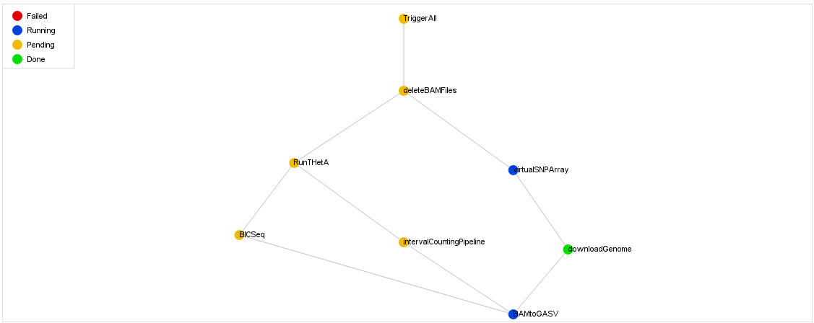

#THetA pipeline

This pipeline uses [Luigi](https://github.com/spotify/luigi) to automate the download, processing, and data analysis of files related to THetA, a software suite that uses cancer genomic structural variation to determine tumor heterogeneity in a sample. A pipeline is helpful because the inputs for each program can be convoluted and manual runs will be unorganized, take forever, and break. This pipeline automates and organizes the complete suite of software runs for as few or as many samples specified. Luigi's centralized server and worker model makes it efficient, safe, and informational.

[THetA](https://github.com/raphael-group/THetA) was developed and written by the [Raphael Lab](http://compbio.cs.brown.edu/) at Brown University's CCMB.

#Structure

Use `./install` to ensure the correct dependencies, download the SNP files, and to generate the `.class` files.

The pipeline code is in `luigi_pipeline.py`. 

The executables for each software component are in `/pipelineSoftware`.

The shell scripts for running each step of the pipeline are in `/pipeline`. 

##Included software
+ CGHub
+ intervalCountingPipeline (for read depth)
+ BAMtoGASV, BICSeq, BICSeqtoTHetA
+ THetA (as a submodule, since updates are still occurring.)
+ Virtual SNP Array
	+ SNP files hosted on S3, downloaded in install script.

##Dependency chart

##Output structure

	all_downloads
	`-- a_genome
	    |-- NORMAL
	    |   `-- downloadHash
	    |       |-- normal_genome.bam
	    |       `-- normal_genome.bam.bai
	    `-- TUMOR
	        `-- downloadHash
	            |-- tumor_genome.bam
	            `-- tumor_genome.bam.bai
	            
	all_outputs
	`-- a_genome
	    |-- BAMtoGASV_output
	    |   |-- NORMAL
	    |   |   |-- NORMAL.a_genome-lib1.concordant
	    |   |   |-- NORMAL.a_genome-lib1.deletion
	    |   |   |-- NORMAL.a_genome-lib1.divergent
	    |   |   |-- NORMAL.a_genome-lib1.inversion
	    |   |   `-- NORMAL.a_genome-lib1.translocation
	    |   `-- TUMOR
	    |       `-- same_as_NORMAL
	    |-- BICSeq
	    |   |-- a_genome.bicseg
	    |   `-- bicseq_outputs
	    |-- intervalPipeline
	    |   `-- a_genome.txt.processed
	    |-- THetA
	    |   |-- a_genome.n2.pdf
	    |   |-- a_genome.n2.results
	    |   `-- a_genome.N_processed
	    `-- virtualSNPArray
	        `-- a_genome.BAlleleFreqs

#Execution

##Step 1: Generating the files to download

The pipeline takes a JSON file with the names of samples and associated metadata as input. To generate this file, use `./pipeline/cgquery` with appropriate parameters. Very important: you need your own key to access the UCSC Genetorrent client!
###Procedure
1. Use a query such as `./pipeline/cgquery "library_strategy=WGS" >> seq.txt`. Make sure the output is piped to `seq.txt`. Details on how to use query filters can be found in the CGQuery handbook.
2. In `pipeline/`, run `processCGQueryforPipeline.py`. A JSON file called `tumor_sample_info.json` should be generated in the top level directory.

##Step 2: Start up the server

Start a luigi server by running `luigid` in a seperate terminal process. This is the central scheduler which assigns tasks to workers.

If that doesn't work, try `PYTHONPATH=. python bin/luigid`. Note that you need Tornado for this to work. 

The server will run on port 8082.

##Step 3: Run the pipeline

Start the pipeline by running `python luigi_pipeline.py`. The pipeline will start running automatically if the `tumor_sample_info.json` file exists. Downloads will be written to `all_downloads` and outputs will be written to `all_outputs`. 

Some useful configurations with the command line may include:

+ `--local-scheduler` : This runs the pipeline without the central planner. Note that you can only use 1 worker if you use the local scheduler.
+ `--workers X` : Runs the pipeline with X workers. By default, it runs with 16 workers.

While the pipeline is running, go to `http://localhost:8082` to get a dynamic overview of the pipeline's excecution.

#Technical Details

Each script is set up as a Task, which is a class comprised of Parameters and requires(), run(), and output() methods. 

+ Parameters: Wrappers around some data value which is passed around between tasks.
+ `requires()`: The other preceding Task(s) that is/are "required" before this Task is run.
+ `run()`: The code that defines a "run" of this Task. Usually, this sets up the correct paths and runs a shell script.
+ `output()`: Return the local data file that signals the completion of the Task. This is wrapped in a LocalTarget.

The order of execution is `requires() -> run() -> output()`.

There are many other classes for Hadoop and recurrent pipelines, which are in the documentation if necessary.

##Important tidbits

These are the kinds of details I wish were in the docs. Hopefully, they save some time if you modify the code.

+ Instance variables do not update across methods. This leads to some subtle bugs if output relies on some updated value, because the output file will be in a different location and the Task will seem to have never finished.
+ If the output for a Task already exists, the `run()` method will not be executed and Luigi will continue.
+ The browser must be open on the machine that the server is running on.
+ In order to stop the pipeline on a bad shell script run, the construction `if *my subprocess.call([])* != 0` is used.
+ Parameters can only be unpacked in methods, not in the constructor. Parameters are passed as `kwargs`.
+ Workers can be configured to have multiple processes by constructing them in the code, e.g. `w = Worker.worker(num_processes=8)`.
+ It's better not to have a "TriggerAll" class because the dependency graph becomes incomprehensibly dense. Instead, the pipeline is kicked off by a list of top-level Tasks which are divided among the worker pool.
+ It's much more fool-proof to make each Task have an output of some sort (otherwise you have to do some hacking with the optional `complete()` method). Even if a Task does not work with local files, make it `touch` some dummy file and return that as output.
+ Keeping the heavy-lifting of the run method in shell script keeps code modular and makes testing easier. It's easier to isolate actual pipeline problems when you're sure that your `runX` script works. Try to keep the ratio of Tasks to shell scripts 1 to 1.
+ The top-level task should be triggered first. It is not run until the very end, but the `requires()` method triggers a cascade that reaches down to the lowest-level Task. Presumably, this requires no other Tasks or just some local Target, so it will terminate the cascade and execute `run()`.
+ If you want to debug the code, make a new JSON file that contains only one genome's info.
+ All the internal data usage is in the `samples` dictionary. Each name maps to the vital info that's needed for a run.
